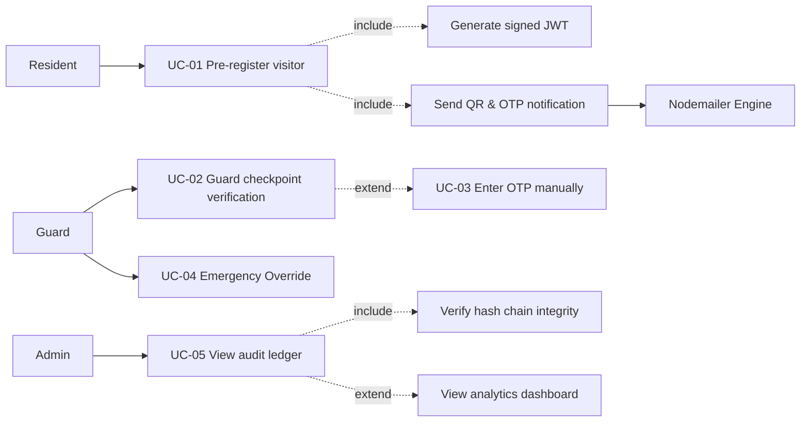
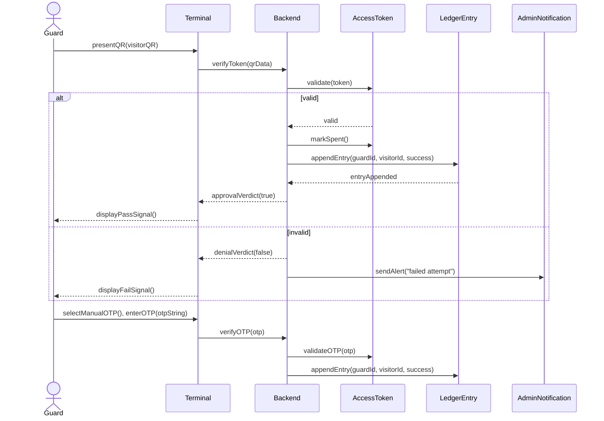
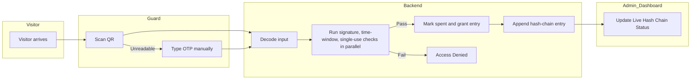
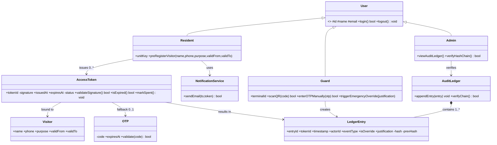
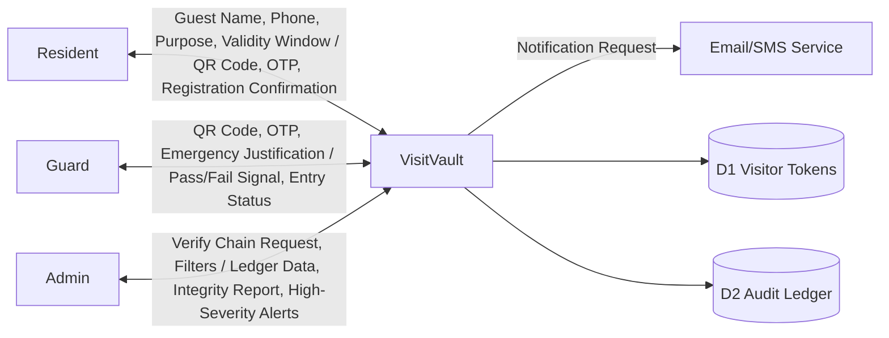
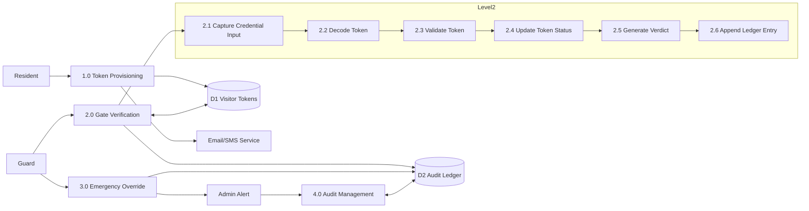

# Worksheet diagrams

## Use case diagram

```mermaid
flowchart LR
Resident-->UC01[UC-01 Pre-register visitor]
UC01-. include .->JWT[Generate signed JWT]
UC01-. include .->Notify[Send QR & OTP notification]
Notify-->Mail[Nodemailer Engine]
Guard-->UC02[UC-02 Guard checkpoint verification]
UC02-. extend .->UC03[UC-03 Enter OTP manually]
Guard-->UC04[UC-04 Emergency Override]
Admin-->UC05[UC-05 View audit ledger]
UC05-. include .->Verify[Verify hash chain integrity]
UC05-. extend .->Analytics[View analytics dashboard]
```
## Sequence

```mermaid
sequenceDiagram
actor Guard
participant Terminal
participant Backend
participant AccessToken
participant LedgerEntry
participant AdminNotification
Guard->>Terminal: presentQR(visitorQR)
Terminal->>Backend: verifyToken(qrData)
Backend->>AccessToken: validate(token)
alt valid
AccessToken-->>Backend: valid
Backend->>AccessToken: markSpent()
Backend->>LedgerEntry: appendEntry(guardId, visitorId, success)
LedgerEntry-->>Backend: entryAppended
Backend-->>Terminal: approvalVerdict(true)
Terminal-->>Guard: displayPassSignal()
else invalid
Backend-->>Terminal: denialVerdict(false)
Backend->>AdminNotification: sendAlert("failed attempt")
Terminal-->>Guard: displayFailSignal()
end
Guard->>Terminal: selectManualOTP(), enterOTP(otpString)
Terminal->>Backend: verifyOTP(otp)
Backend->>AccessToken: validateOTP(otp)
Backend->>LedgerEntry: appendEntry(guardId, visitorId, success)
```
## Activity and swimlane

```mermaid
flowchart LR
subgraph Visitor
A[Visitor arrives]
end
subgraph Guard
B[Scan QR]
C[Type OTP manually]
end
subgraph Backend
D[Decode input]
E[Run signature, time-window, single-use checks in parallel]
F[Mark spent and grant entry]
G[Append hash-chain entry]
H[Access Denied]
end
subgraph Admin_Dashboard
I[Update Live Hash Chain Status]
end
A-->B-->D-->E
B--Unreadable-->C-->D
E--Pass-->F-->G-->I
E--Fail-->H
```
## Class diagram

```mermaid
classDiagram
class User{<<abstract>> #id #name #email +login() bool +logout() void}
User<|--Resident
User<|--Guard
User<|--Admin
class Resident{+unitKey +preRegisterVisitor(name,phone,purpose,validFrom,validTo)}
class Guard{+terminalId +scanQR(code) bool +enterOTPManually(otp) bool +triggerEmergencyOverride(justification)}
class Admin{+viewAuditLedger() +verifyHashChain() bool}
class AccessToken{+tokenId -signature +issuedAt +expiresAt -status +validateSignature() bool +isExpired() bool +markSpent() void}
class Visitor{+name +phone +purpose +validFrom +validTo}
class OTP{-code +expiresAt +validate(code) bool}
class NotificationService{+sendEmail(to,token) bool}
class AuditLedger{+appendEntry(entry) void +verifyChain() bool}
class LedgerEntry{+entryId +tokenId +timestamp +actorId +eventType +isOverride +justification -hash -prevHash}
Resident-->AccessToken: issues 0..*
AccessToken-->Visitor: bound to
AccessToken-->OTP: fallback 0..1
AccessToken-->LedgerEntry: results in
Resident-->NotificationService: uses
AuditLedger*--LedgerEntry: contains 1..*
Admin-->AuditLedger: verifies
Guard-->LedgerEntry: creates
```
## DFD Level 0

```mermaid
flowchart LR
Resident<-->|Guest Name, Phone, Purpose, Validity Window / QR Code, OTP, Registration Confirmation|System[VisitVault]
Guard<-->|QR Code, OTP, Emergency Justification / Pass/Fail Signal, Entry Status|System
Admin<-->|Verify Chain Request, Filters / Ledger Data, Integrity Report, High-Severity Alerts|System
System-->|Notification Request|Email[Email/SMS Service]
System-->D1[(D1 Visitor Tokens)]
System-->D2[(D2 Audit Ledger)]
```
## DFD Level 1 and Level 2

```mermaid
flowchart LR
Resident-->P1[1.0 Token Provisioning]-->D1[(D1 Visitor Tokens)]
P1-->Email[Email/SMS Service]
Guard-->P2[2.0 Gate Verification]-->D2[(D2 Audit Ledger)]
P2<-->D1
Guard-->P3[3.0 Emergency Override]-->D2
P3-->Admin[Admin Alert]
Admin-->P4[4.0 Audit Management]<-->D2
subgraph Level2
A[2.1 Capture Credential Input]-->B[2.2 Decode Token]-->C[2.3 Validate Token]-->D[2.4 Update Token Status]-->E[2.5 Generate Verdict]-->F[2.6 Append Ledger Entry]
end
P2-->A
```
